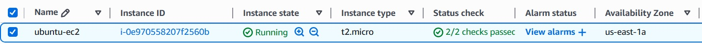
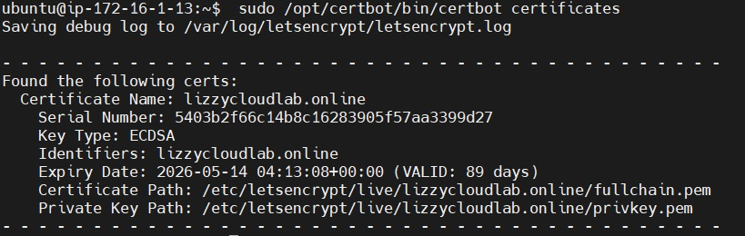

# Secure Static Website Deployment on AWS EC2 using Nginx & HTTPS

## Project Overview
This project demonstrates how to deploy a secure static website on an AWS EC2 instance using the Nginx web server and HTTPS encryption.

The goal of this project is to practice fundamental DevOps and cloud engineering skills including:

- Launching an EC2 instance
- Connecting securely using SSH
- Installing and configuring Nginx
- Deploying a static website
- Securing the website with HTTPS
- Managing a Linux server in the cloud

---

## Technologies Used

- **AWS EC2** – cloud compute infrastructure
- **Ubuntu Linux** – server operating system
- **Nginx** – web server used to host the static website
- **SSH** – secure remote server access
- **Let's Encrypt (Certbot)** – SSL certificate for HTTPS encryption

---

## Deployment Steps

1. Launch an EC2 instance in AWS

2. Connect to the server securely using SSH

```bash
ssh -i your-key.pem ubuntu@your-ec2-public-ip
```

3. Update the server packages

```bash
sudo apt update
sudo apt upgrade -y
```

4. Install Nginx web server

```bash
sudo apt install nginx -y
```

5. Start and enable Nginx

```bash
sudo systemctl start nginx
sudo systemctl enable nginx
```

6. Verify Nginx is running

```bash
sudo systemctl status nginx
```

7. Deploy the static website files

```bash
cd /var/www/html
sudo rm index.nginx-debian.html
sudo nano index.html
```

8. Install Certbot for HTTPS

```bash
sudo apt install certbot python3-certbot-nginx -y
```

9. Configure SSL certificate using Let's Encrypt

```bash
sudo certbot --nginx
```

10. Verify HTTPS certificate renewal

```bash
sudo certbot renew --dry-run
```

11. Access the website from a browser

Open your browser and visit:

```
http://your-ec2-public-ip
```

or

```
https://your-domain-name
```

---

## Expected Outcome

After deployment, the website should be accessible from a browser using the EC2 public IP address or the configured domain name.

---

## Project Architecture

The infrastructure was deployed inside a custom AWS VPC network.

**VPC CIDR:**  
10.0.0.0/16

**Subnets created:**

- Frontend Subnet: **10.0.0.0/24** (EC2 Web Server)
- Backend Subnet: **10.0.1.0/24**
- Database Subnet: **10.0.2.0/24**

The EC2 instance hosting the website resides in the **frontend subnet** and is accessed through an **Internet Gateway**.

---

## Project Evidence

### Architecture Diagram


### EC2 Instance


### SSL Certificate


### Website Screenshot


---

## Lessons Learned

During this project I learned how to:

- Design a VPC with multiple subnets
- Launch and configure EC2 instances
- Install and configure Nginx on Ubuntu
- Secure web traffic using HTTPS with Let's Encrypt
- Configure Security Groups to restrict SSH access
- Document infrastructure and architecture for reproducibility

---

## Live Website

https://lizzycloudlab.online

---

## Cost Management

To avoid unnecessary AWS charges, the EC2 infrastructure used in this project was **terminated after successful deployment and testing**.
