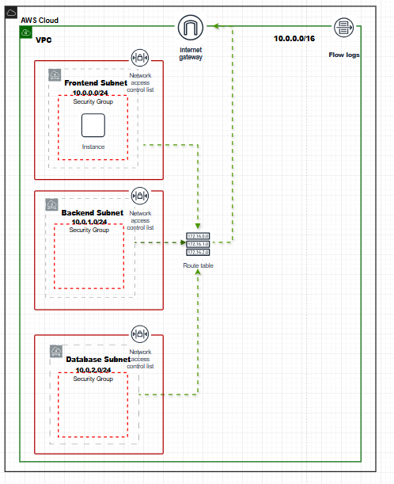
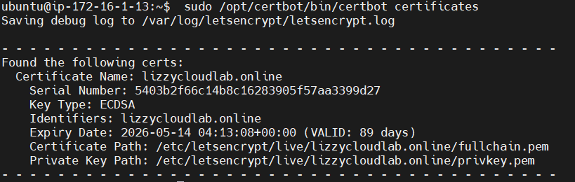

# Static Website Deployment on AWS EC2 using Nginx

## Project Overview
This project demonstrates how to deploy a static website on an AWS EC2 instance using the Nginx web server.

The goal of this project is to practice basic DevOps and cloud engineering skills including:

- Launching an EC2 instance
- Connecting securely using SSH
- Installing and configuring Nginx
- Deploying a static website
- Managing a Linux server

## Technologies Used
- AWS EC2
- Ubuntu Linux
- Nginx
- SSH

## Deployment Steps
1. Launch an EC2 instance in AWS
2. Connect to the server using SSH
3. Install Nginx
4. Deploy the static website files
5. Access the website using the EC2 public IP

## Expected Outcome
After deployment, the website should be accessible from a browser using the EC2 public IP address.
## Architecture

This project was deployed in AWS using a custom VPC network design.

VPC CIDR: 10.0.0.0/16

Subnets created:

- Frontend Subnet: 10.0.0.0/24 (EC2 web server)
- Backend Subnet: 10.0.1.0/24
- Database Subnet: 10.0.2.0/24

The EC2 instance hosting the website was deployed in the frontend subnet and accessed through an Internet Gateway.

---

## Project Evidence

## Architecture Diagram

## EC2 Instance

## SSL Certificate

## Website

---

## Lessons Learned

During this project I learned how to:

- Design a VPC with multiple subnets
- Launch and configure EC2 instances
- Install and configure Nginx on Ubuntu
- Secure web traffic using HTTPS with Let's Encrypt
- Configure Security Groups to restrict SSH access to my IP
- Document infrastructure and architecture for reproducibility
## Live Website

https://lizzycloudlab.online
## Cost Management

To avoid unnecessary AWS charges, the EC2 infrastructure used in this project was terminated after successful deployment and validation.
